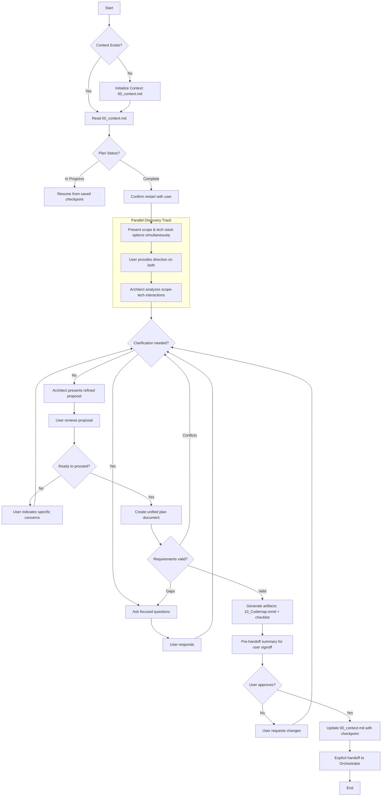

# Architect Planning Loop with User

# Requirements:

1. **Always** read the context before starting a new planning session.
2. **Never** plan changes that affect checklist items marked `[$]` (God Mode).
3. **Ensure** all requirements are documented before creating the checklist.
4. **Update** the Source of Truth (00_context.md) before handoff.
