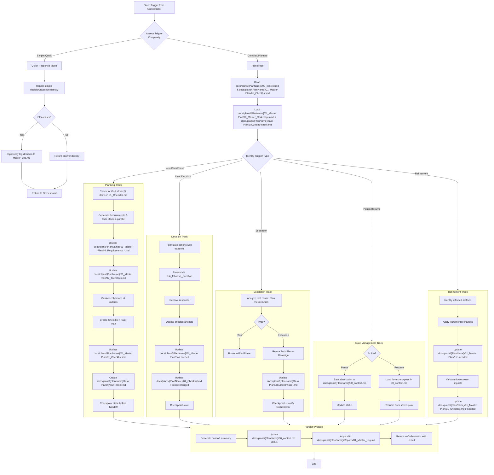

# Architect Sub-Agent Loop (Triggered by Orchestrator)

This loop is executed when the Orchestrator requires planning, a user decision, or escalation handling.

# Requirements:

1. **Decision Proxy**: When triggered for a user decision, the Architect must use `ask_followup_question` and update the plan based on the response.
2. **Escalation Handling**: Must differentiate between a flaw in the plan (requiring a full re-plan) and a flaw in execution (requiring a revised task plan and re-assignment).
3. **State Update**: Always update `00_context.md` before returning control to the Orchestrator (Plan Mode only).

# Trigger Complexity Assessment:

## Quick Response Mode Triggers:
- Simple yes/no decisions
- Clarifications on existing plan items
- Priority adjustments within existing scope
- Minor wording changes
- Estimated response < 5 minutes

## Plan Mode Triggers:
- New phase planning
- Major scope changes requiring re-planning
- Escalations requiring plan modifications
- Architecture or requirement changes
- User decision affecting multiple plan components

# File Structure Integration:

## Documents Read at Initialization:
- `docs/plans/{PlanName}/00_context.md` - Source of Truth
- `docs/plans/{PlanName}/01_Master Plan/01_Checklist.md` - Task Tracking
- `docs/plans/{PlanName}/01_Master Plan/10_Master_Codemap.mmd` - Architecture Diagram
- `docs/plans/{PlanName}/Task Plans/{CurrentPhase}.md` - Current Phase Steps

## Documents Updated During Workflow:
- `docs/plans/{PlanName}/00_context.md` - Checkpoint updates
- `docs/plans/{PlanName}/01_Master Plan/01_Checklist.md` - Task updates
- `docs/plans/{PlanName}/01_Master Plan/02_Techstack.md` - Tech stack changes
- `docs/plans/{PlanName}/01_Master Plan/03_Requirements_*.md` - Requirement updates
- `docs/plans/{PlanName}/Task Plans/{Phase}.md` - Phase plan revisions
- `docs/plans/{PlanName}/Reports/01_Master_Log.md` - Activity logging
