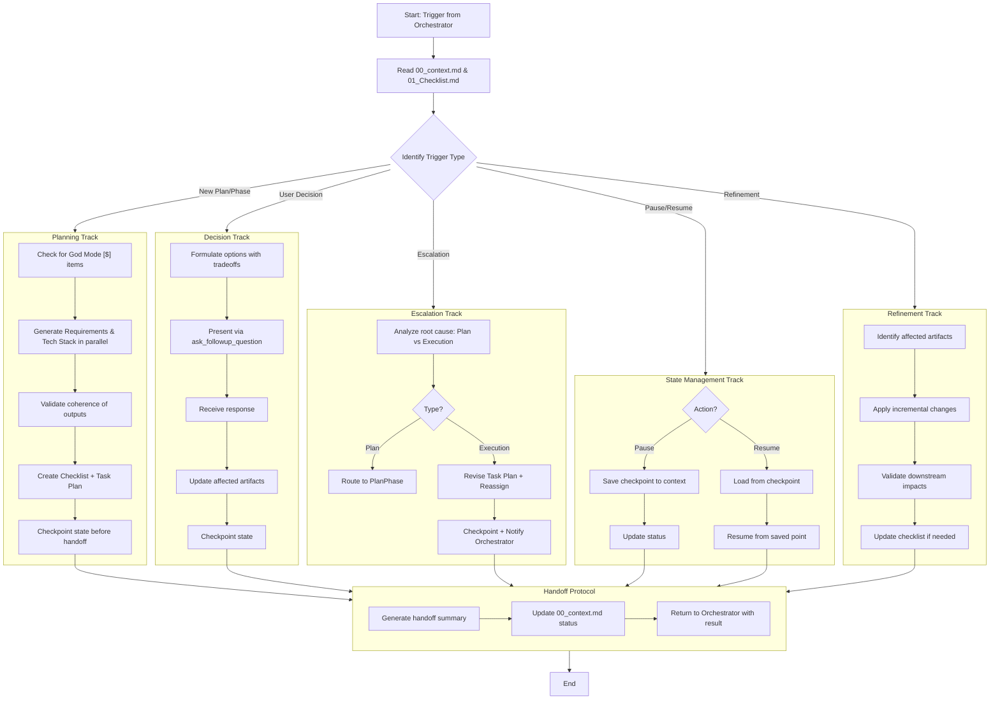

# Architect Sub-Agent Loop (Triggered by Orchestrator)

This loop is executed when the Orchestrator requires planning, a user decision, or escalation handling.

# Requirements:

1. **Decision Proxy**: When triggered for a user decision, the Architect must use `ask_followup_question` and update the plan based on the response.
2. **Escalation Handling**: Must differentiate between a flaw in the plan (requiring a full re-plan) and a flaw in execution (requiring a revised task plan and re-assignment).
3. **State Update**: Always update `00_context.md` before returning control to the Orchestrator.
