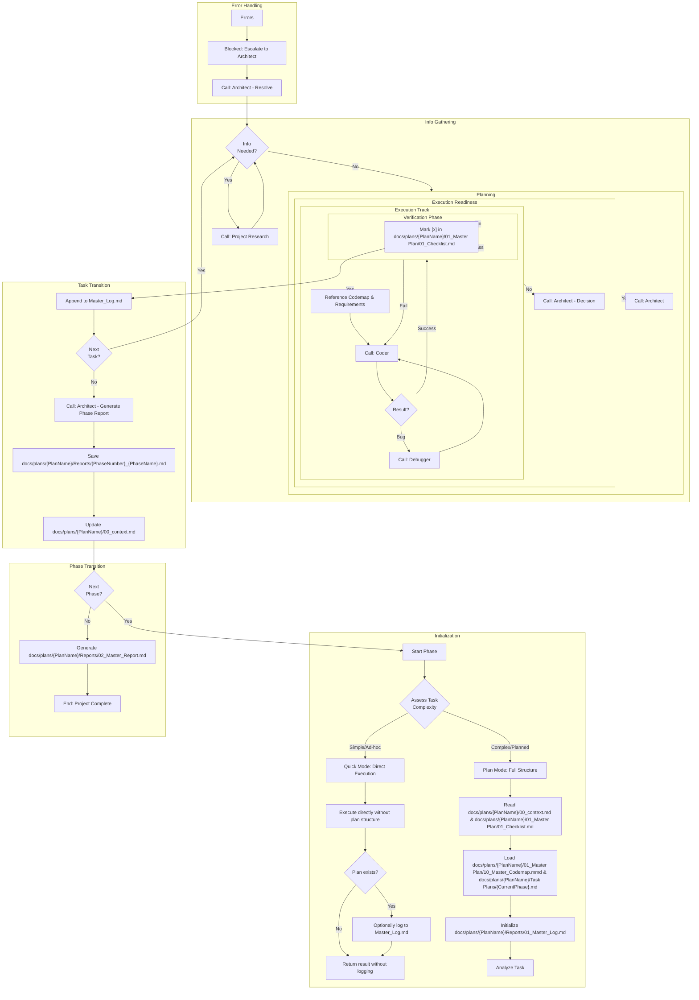

# Orchestrator Loop

# Requirements:

1. **Always** verify Coder output against the Phase Document and Checklist (in Plan Mode).
2. **Never** proceed to the next task if the current one is not verified [x] (in Plan Mode).
3. **Escalate** to Architect if a task fails 2 times or requires a plan change.
4. **Maintain** the Source of Truth (00_context.md) at all times (in Plan Mode).

# Task Complexity Assessment:

## Quick Mode Triggers (Ad-hoc Execution):
- User explicitly uses words: "quick", "just", "simple", "only"
- Single file edit (< 50 lines changed)
- Read-only operations (exploration, inspection, questions)
- No checklist item referenced
- Estimated completion < 10 minutes
- No architectural changes

## Plan Mode Triggers (Full Structure):
- Multi-file changes
- Architectural or structural changes
- User references a plan/phase/checklist
- Estimated completion > 10 minutes
- Requires coordination between components
- User explicitly requests planning/documentation

# File Structure Integration:

## Documents Loaded at Initialization:
- `docs/plans/{PlanName}/00_context.md` - Source of Truth
- `docs/plans/{PlanName}/01_Master Plan/01_Checklist.md` - Task Tracking
- `docs/plans/{PlanName}/01_Master Plan/10_Master_Codemap.mmd` - Architecture Diagram
- `docs/plans/{PlanName}/Task Plans/{CurrentPhase}.md` - Phase-Specific Steps

## Documents Referenced During Execution:
- `docs/plans/{PlanName}/01_Master Plan/02_Techstack.md` - Technology Choices
- `docs/plans/{PlanName}/01_Master Plan/03_Requirements_*.md` - Validation Specs
- `docs/plans/{PlanName}/01_Master Plan/11_Unit_Codemap_*.mmd` - Component Details

## Documents Updated During Workflow:
- `docs/plans/{PlanName}/Reports/01_Master_Log.md` - Activity Audit Trail
- `docs/plans/{PlanName}/01_Master Plan/01_Checklist.md` - Mark [x] on completion
- `docs/plans/{PlanName}/00_context.md` - Update checkpoint after phase
- `docs/plans/{PlanName}/Reports/{PhaseNumber}_{PhaseName}.md` - Phase completion report
- `docs/plans/{PlanName}/Reports/02_Master_Report.md` - Project completion report