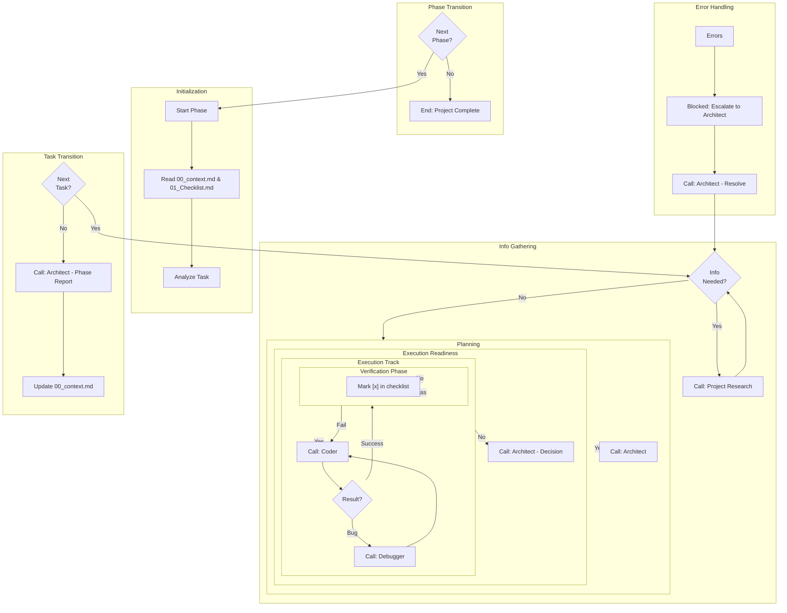

# Orchestrator Loop

# Requirements:

1. **Always** verify Coder output against the Phase Document and Checklist.
2. **Never** proceed to the next task if the current one is not verified [x].
3. **Escalate** to Architect if a task fails 2 times or requires a plan change.
4. **Maintain** the Source of Truth (00_context.md) at all times.
