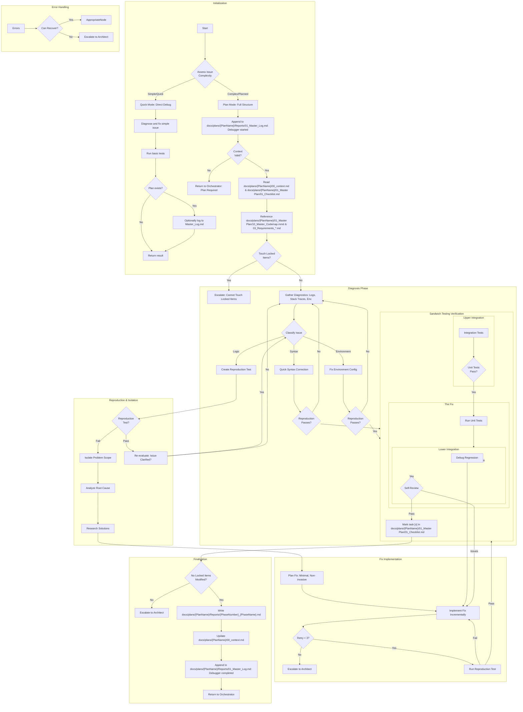

# Debug Loop

# Requirements:

1. **Never** simplify a test to pass.
2. **Always** use comprehensive integration tests using Sandwich Testing methodology (Plan Mode).
3. **Never** skip a test; avoid regressions at all costs.
4. **Always** create a reproduction test before attempting a fix (Plan Mode for complex issues).
5. **Stop** after 3 failed fix attempts and escalate to Architect.

# Issue Complexity Assessment:

## Quick Mode Triggers (Direct Debug):
- Simple syntax errors
- Obvious typos causing errors
- Missing import statements
- Simple null pointer issues with clear fixes
- Environment variable issues
- Estimated fix < 10 minutes

## Plan Mode Triggers (Full Structure):
- Logic errors requiring deep analysis
- Race conditions or concurrency issues
- Performance problems
- Integration failures
- Multiple potential root causes
- Requires architectural understanding
- Estimated fix > 10 minutes

# File Structure Integration:

## Documents Read at Initialization:
- `docs/plans/{PlanName}/00_context.md` - Source of Truth
- `docs/plans/{PlanName}/01_Master Plan/01_Checklist.md` - Task Tracking
- `docs/plans/{PlanName}/01_Master Plan/10_Master_Codemap.mmd` - Architecture Diagram
- `docs/plans/{PlanName}/01_Master Plan/03_Requirements_*.md` - Validation Specs

## Documents Updated During Workflow:
- `docs/plans/{PlanName}/01_Master Plan/01_Checklist.md` - Mark [x] on completion
- `docs/plans/{PlanName}/Reports/01_Master_Log.md` - Append start/completion events
- `docs/plans/{PlanName}/Reports/{PhaseNumber}_{PhaseName}.md` - Phase completion report
- `docs/plans/{PlanName}/00_context.md` - Update checkpoint after completion
