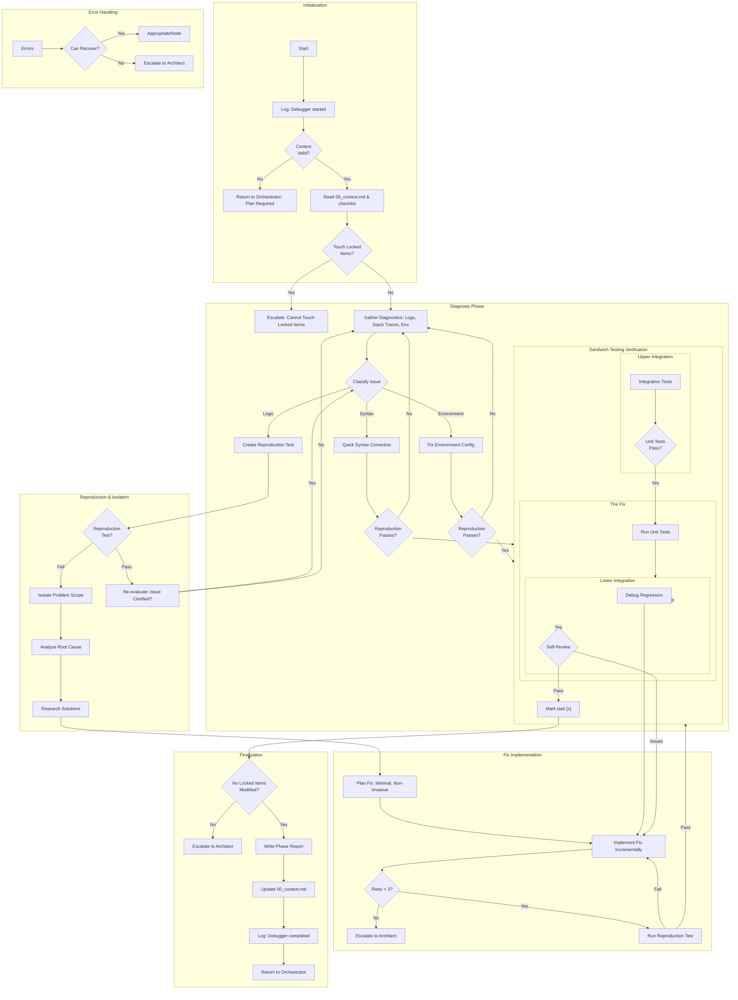

# Debug Loop

# Requirements:

1. **Never** simplify a test to pass.
2. **Always** use comprehensive integration tests using Sandwich Testing methodology
2. **Never** skip a test; avoid regressions at all costs.
3. **Always** create a reproduction test before attempting a fix.
4. **Stop** after 3 failed fix attempts and escalate to Architect.