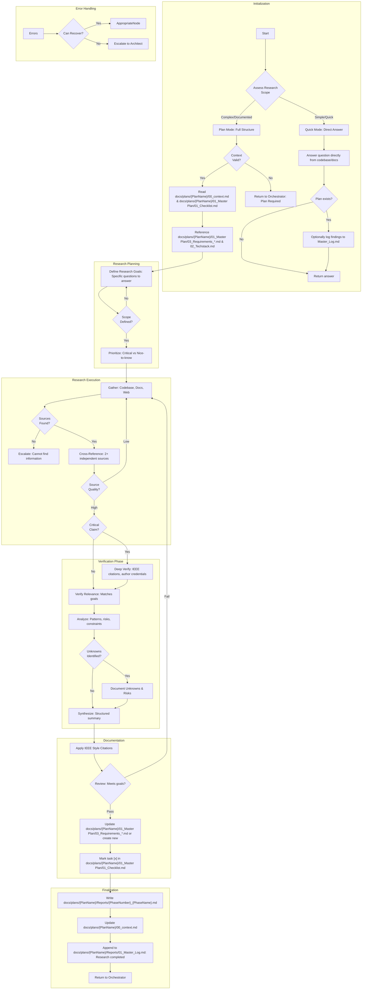

# Project Research Loop

# Requirements:

1. **IEEE Style Citations** required for all external research (Plan Mode).
2. **Cross-reference** at least 2 independent sources for critical claims (Plan Mode).
3. **Verify** findings against the actual codebase if applicable.
4. **Document** all "Unknowns" or risks identified during research (Plan Mode).

# Research Scope Assessment:

## Quick Mode Triggers (Direct Answer):
- Simple "what" or "how" questions about existing code
- Reading configuration or dependencies
- Checking current implementation details
- Exploratory questions
- Estimated < 10 minutes

## Plan Mode Triggers (Full Structure):
- Research requiring external sources
- Technology evaluation or comparison
- Architectural decision research
- Requirements gathering
- Multi-source validation needed
- Results need documentation in Requirements
- Estimated > 10 minutes

# File Structure Integration:

## Documents Read at Initialization:
- `docs/plans/{PlanName}/00_context.md` - Source of Truth
- `docs/plans/{PlanName}/01_Master Plan/01_Checklist.md` - Task Tracking
- `docs/plans/{PlanName}/01_Master Plan/03_Requirements_*.md` - Existing Requirements
- `docs/plans/{PlanName}/01_Master Plan/02_Techstack.md` - Technology Choices

## Documents Updated During Workflow:
- `docs/plans/{PlanName}/01_Master Plan/03_Requirements_*.md` - Update or create new requirements
- `docs/plans/{PlanName}/01_Master Plan/01_Checklist.md` - Mark [x] on completion
- `docs/plans/{PlanName}/Reports/01_Master_Log.md` - Append completion event
- `docs/plans/{PlanName}/Reports/{PhaseNumber}_{PhaseName}.md` - Phase completion report
- `docs/plans/{PlanName}/00_context.md` - Update checkpoint after completion
