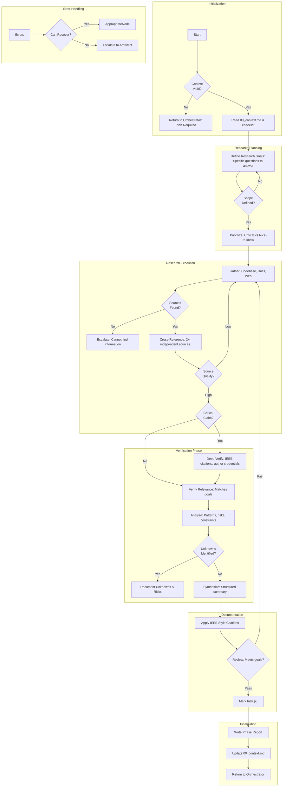

# Project Research Loop

# Requirements:

1. **IEEE Style Citations** required for all external research.
2. **Cross-reference** at least 2 independent sources for critical claims.
3. **Verify** findings against the actual codebase if applicable.
4. **Document** all "Unknowns" or risks identified during research.
