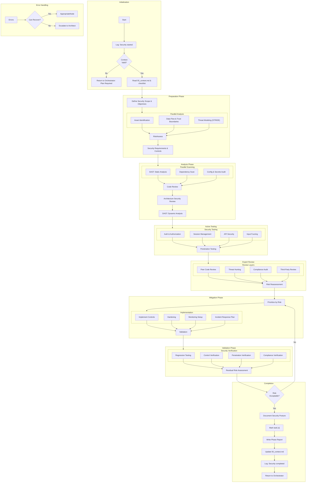

# Comprehensive Security Assessment Flow

# Comprehensive Security Requirements:

## Core Security Principles
1. **Defense in Depth**: Multiple layers of security controls
2. **Least Privilege**: Minimum necessary permissions principle
3. **Fail-Safe Defaults**: Secure defaults, explicit allow
4. **Zero Trust**: Never trust, always verify

## Security Controls Categories
1. **Preventive Controls**: Input validation, access controls, encryption
2. **Detective Controls**: Logging, monitoring, intrusion detection
3. **Corrective Controls**: Incident response, patch management
4. **Deterrent Controls**: Security awareness, policies

## Compliance & Standards
1. **OWASP Top 10**: Web application security
2. **NIST Cybersecurity Framework**: Risk management
3. **ISO 27001**: Information security management
4. **GDPR/CCPA**: Data protection regulations

## Automated Security Tools
1. **SAST Tools**: ESLint security, SonarQube, Checkmarx
2. **DAST Tools**: OWASP ZAP, Burp Suite, Nessus
3. **Dependency Scanning**: npm audit, Snyk, OWASP Dependency Check
4. **Container Security**: Trivy, Clair, Aqua Security

## Security Testing Types
1. **Unit Security Tests**: Input validation, boundary testing
2. **Integration Security Tests**: API security, data flow
3. **System Security Tests**: Penetration testing, load testing
4. **Acceptance Security Tests**: Compliance validation

## Risk Management
1. **Risk Identification**: Asset valuation, threat modeling
2. **Risk Analysis**: Likelihood and impact assessment
3. **Risk Mitigation**: Control implementation prioritization
4. **Risk Monitoring**: Continuous assessment and reporting
